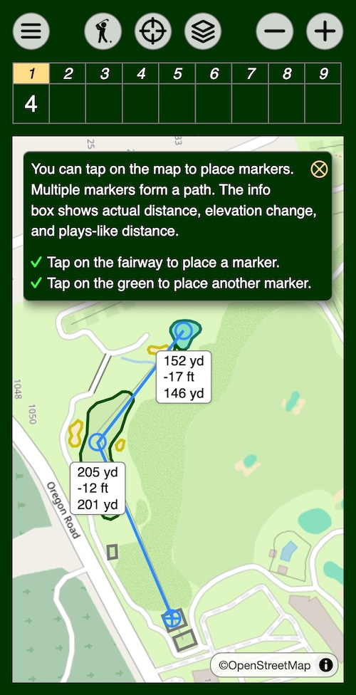

## Ace golf map and scorecard browser app

[This app](https://bdlucas1.github.io/ace) runs in a browser on a mobile phone and provides essential on-course functions: a scorecard and a map with golf course features, distance, and elevation information. It runs entirely in a browser so there is no app to install, and it is based entirely on publicly available open-source information, primarily OpenStreetMap. There is no fee or login required (or available). Course data is downloaded as needed and is cached for later use.

Map data showing tees, fairways, bunkers, and greens is available for tens of thousands of golf courses worldwide. Even if your course is not mapped the app provides aerial imagery with elevation data which you can use to get distance and elevation information. You can get involved in mapping new courses or improving existing maps through [OpenStreetMap.org](https://openstreetmap.org). Be sure to follow their [guidelines for golf courses](https://wiki.openstreetmap.org/wiki/Tag:leisure%3Dgolf_course).

Follow [this link](https://bdlucas1.github.io/ace) to run the app in your browser from a mobile phone or from your desktop. The first time the app runs it will walk you through a short tour of features, as illustrated in the screenshot. You can come back to the tour later through the menu at the upper left corner.

You may wish to bookmark the app. On an iPhone if you bookmark the app using the "Add to Home Screen" function, when you start the app it will take over the entire screen, giving you an experience more like a native app. The app is designed to run in portrait orientation, so if your phone has an orientation sensor I suggest locking your phone orientation while running the app.

You can report issues, provide feedback, ask questions, or make suggestions by [opening an issue](https://github.com/bdlucas1/ace/issues) or [starting a discussion](https://github.com/bdlucas1/ace/discussions).

